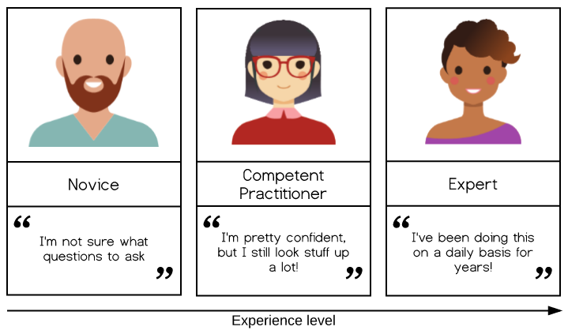
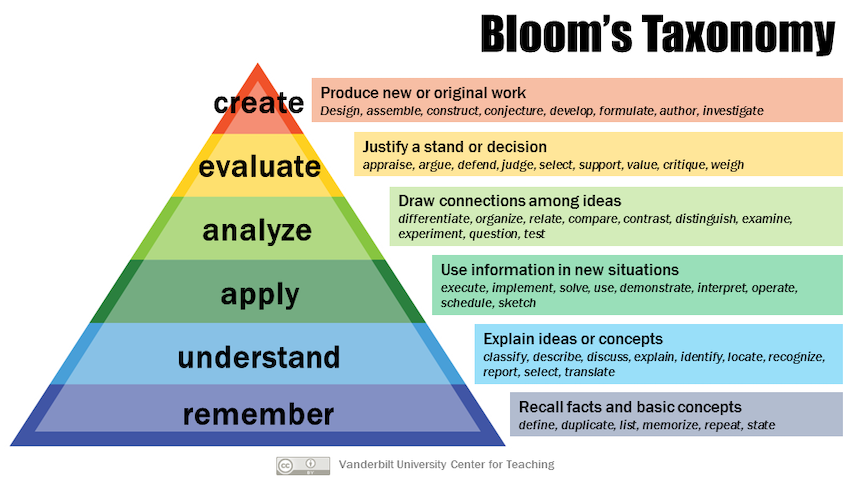
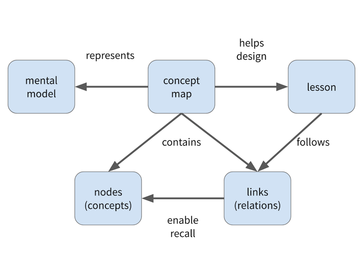

# Introduction to Workflows with CWL

__2020-03-26 - 2020-03-27__

---
## Logistics

- shared notes in a HackMD - check your email for URL
- we'll use the CWL Gitter for text communication
- take regular breaks
- one hour for "lunch" at 12:30 CET

---
## Acknowledgement

---
## Why Create This Tutorial?

- (Anecdotal) evidence suggests CWL is difficult for novices to learn
- Moving from shell scripts to workflows is also hard (again, anecdotally)
- I think we should care about this

---
## Why Create This Tutorial?

_image CC-BY The Carpentries_

---
## What do learners do to find out what they need to know?

- Expert
  - refer to the language specification
  - ask on CWL Gitter/Discourse
- Competent Practitioner:
  - check the User Guide
  - ask on CWL Gitter/Discourse
- Novice:
  - User Guide?

---
## Reverse Instructional Design

- based on research summarised in The Carpentries Instructor Training

1. determine target audience
2. determine practical skill(s) they need to learn
3. create concept maps to guide curriculum design
4. design exercises to assess learner progress towards objectives\*
5. write connecting material\*

\* I don't expect us to reach this point during the sprint

---
## Who Is The Target Audience?

- The first question we need to answer today!
  - What's their background?
  - What problem do they have, which could be solved by learning how to use workflows/CWL?
  - How can this tutorial help them?
- Learner profiles can help with this

---
## Learner Profile Example

João is an agricultural engineer doing his masters in soil physics. His programming experience is a first year programming course using C. He was never able to use this low-level programming in his activities, and never programmed after the first year.

His work consists of evaluating physical properties of soil samples from different conditions. Some of the soil properties are measured by an automated device that sends logs in a text format to his machine. João has to open each file in Excel, crop the first and last quarters of data values, and calculate an average.

Software Carpentry will show João how to write shell scripts to count the lines and crop the right range for each file, and how to use R to read these files and calculate the required statistics. It will also show him how to put his programs and files under version control so that he can re-run analyses and figure out which results may have been affected by changes.

---
## What Are The Learning Objectives?

- We need to be realistic about what audience can learn in the time available (0.5-1 day)
- Having _specific_ objectives helps avoid creep in lesson scope
- _Bloom's Taxonomy_ can help with this

---
## Bloom's Taxonomy

- "By the end of the [lesson|section], learners will be able to..."

- __Aim to move learners up one level__

---
## What Do We Hope To Achieve During The Sprint?

- Get everyone set up to use the GitHub repository
- We need to agree on:
  - target audience
  - learning objectives
  - tooling to be used in the tutorial
- Lesson content
  - exercises
  - concept map(s)
---
## Concept Maps

_image CC-BY The Carpentries_

---
## Question Time

---
